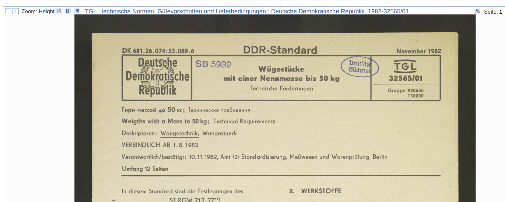
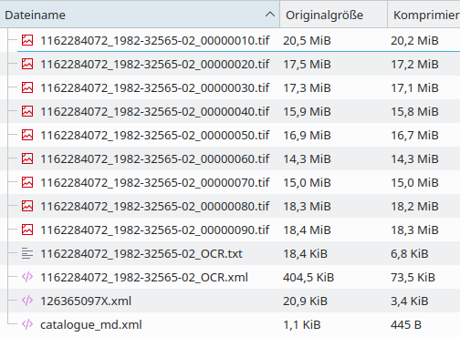
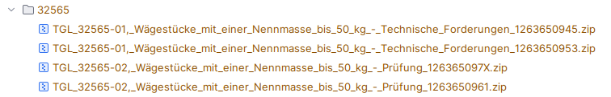

## Deutsche Nationalbibliothek OAI API example code
DNB offers open access to some of their document collections. 
These collection can be accessed via some JavaScript-based
viewer frontend. Next image shows the official bookviewer frontend.



DNB also offer an API, called OAI. Using this API, the documents 
can be accessed using some arbitrary programming language.

## What does this repository contain?
This repository contains code to access one of these collections,
the TGL ("Technische Normen, Gütevorschriften und Lieferbedingungen") 
collection from GDR, which was like DIN for BRD.

It is only example code, that can retrieve a single TGL document
artifact tree. 

The documents are named e.g. *TGL 32565*. With the input *32565*, all
related objects from the TGL collection can be downloaded. These
are metadata, OCR data, and TIFF scans of the original documents.
A set, which is like a version of a document, is downloaded in a ZIP
file and contains the mentioned artifacts for this version.

Next image shows content of some of these ZIP files. Per page,
there is a TIFF image. Besides that, there is also OCR information
and some metadata.



If there are multiple versions of a document, all versions are downloaded,
in separate ZIP files. All ZIP files for a document are downloaded to a newly created
directory named like the document. 

Besides ZIP files, there seem to be additional artifacts. I haven't
checked these, because I was only interested in the TIFF scans.
These links seem to be protected. These files are not downloaded, but
listed with their URLs as "not downloadable".

The local filename of a downloaded zip is created from a file name
sent by the DNB server, like *1263650945.zip* and the documents
title with small sanitation (spaces are replaced by '_', '/' are
replaced by '-'). An example local file name would be
*TGL_32565-01,_Wägestücke_mit_einer_Nennmasse_bis_50_kg_-_Technische_Forderungen_1263650945.zip*

So, downloading document 32565 results in the following structure.



## How to build 
```shell
go build .
```

## How to run
```shell
go run . <command line arguments>
```

A complete session looks like this (also showing available command line options):

```shell
go run . --download true
DNB collector
--dry-run: false
--debug: 0
--download: true
--id: 32565
Query API with URL:
https://services.dnb.de/sru/dnb?maximumRecords=5&operation=searchRetrieve&query=tit%3D%22TGL+32565%22&recordSchema=MARC21-xml&version=1.1

response status code: 200
response content type: text/xml;charset=UTF-8
response content length: -1
Reading XML as raw bytes...
... raw bytes read: 24501
🎉 4 records in XML response.

--- [data set 1] ---
  Title: TGL 32565/01, Wägestücke mit einer Nennmasse bis 50 kg - Technische Forderungen
  Details: Year: 2018
  🔗 Links found:
    -> https://nbn-resolving.org/urn:nbn:de:101:1-2022072702462487314192 (not downloadable)
    -> https://d-nb.info/1263650953/34 (will be downloaded)

--- [data set 2] ---
  Title: TGL 32565/01, Wägestücke mit einer Nennmasse bis 50 kg - Technische Forderungen
  Details: Year: 2018
  🔗 Links found:
    -> https://nbn-resolving.org/urn:nbn:de:101:1-2022072702461859854842 (not downloadable)
    -> https://d-nb.info/1263650945/34 (will be downloaded)

--- [data set 3] ---
  Title: TGL 32565/02, Wägestücke mit einer Nennmasse bis 50 kg - Prüfung
  Details: Year: 2018
  🔗 Links found:
    -> https://nbn-resolving.org/urn:nbn:de:101:1-2022072702462993395705 (not downloadable)
    -> https://d-nb.info/1263650961/34 (will be downloaded)

--- [data set 4] ---
  Title: TGL 32565/02, Wägestücke mit einer Nennmasse bis 50 kg - Prüfung
  Details: Year: 2018
  🔗 Links found:
    -> https://nbn-resolving.org/urn:nbn:de:101:1-2022072702463395241672 (not downloadable)
    -> https://d-nb.info/126365097X/34 (will be downloaded)

Processing: "https://d-nb.info/1263650953/34", Title ="TGL 32565/01, Wägestücke mit einer Nennmasse bis 50 kg - Technische Forderungen"
🎯 filename from header: 1263650953.zip
Downloading file: 1263650953.zip
*****************************************************************************************************************
************************************************************************************************************
Raw bytes downloaded: 231898078
Generated filename of local file: 32565/TGL_32565-01,_Wägestücke_mit_einer_Nennmasse_bis_50_kg_-_Technische_Forderungen_1263650953.zip
💾 File 32565/TGL_32565-01,_Wägestücke_mit_einer_Nennmasse_bis_50_kg_-_Technische_Forderungen_1263650953.zip successfully downloaded and stored
Downloaded file: 1263650953.zip
Processed: https://d-nb.info/1263650953/34
Processing: "https://d-nb.info/1263650945/34", Title ="TGL 32565/01, Wägestücke mit einer Nennmasse bis 50 kg - Technische Forderungen"
🎯 filename from header: 1263650945.zip
Downloading file: 1263650945.zip
******************************************************************************************************************
******************************************************************************************************************
******************************************************************************************************************
***********************************************************************************
Raw bytes downloaded: 446499146
Generated filename of local file: 32565/TGL_32565-01,_Wägestücke_mit_einer_Nennmasse_bis_50_kg_-_Technische_Forderungen_1263650945.zip
💾 File 32565/TGL_32565-01,_Wägestücke_mit_einer_Nennmasse_bis_50_kg_-_Technische_Forderungen_1263650945.zip successfully downloaded and stored
Downloaded file: 1263650945.zip
Processed: https://d-nb.info/1263650945/34
Processing: "https://d-nb.info/1263650961/34", Title ="TGL 32565/02, Wägestücke mit einer Nennmasse bis 50 kg - Prüfung"
🎯 filename from header: 1263650961.zip
Downloading file: 1263650961.zip
*****************************************************************************************************************
***************************************************************************************************************
Raw bytes downloaded: 235086970
Generated filename of local file: 32565/TGL_32565-02,_Wägestücke_mit_einer_Nennmasse_bis_50_kg_-_Prüfung_1263650961.zip
💾 File 32565/TGL_32565-02,_Wägestücke_mit_einer_Nennmasse_bis_50_kg_-_Prüfung_1263650961.zip successfully downloaded and stored
Downloaded file: 1263650961.zip
Processed: https://d-nb.info/1263650961/34
Processing: "https://d-nb.info/126365097X/34", Title ="TGL 32565/02, Wägestücke mit einer Nennmasse bis 50 kg - Prüfung"
🎯 filename from header: 126365097X.zip
Downloading file: 126365097X.zip
*****************************************************************************************************************
***************************************
Raw bytes downloaded: 160272466
Generated filename of local file: 32565/TGL_32565-02,_Wägestücke_mit_einer_Nennmasse_bis_50_kg_-_Prüfung_126365097X.zip
💾 File 32565/TGL_32565-02,_Wägestücke_mit_einer_Nennmasse_bis_50_kg_-_Prüfung_126365097X.zip successfully downloaded and stored
Downloaded file: 126365097X.zip
Processed: https://d-nb.info/126365097X/34
```

## Disclaimer
I did this code only for fun. I needed a single document from this
collection, and got it using the DNBs own document viewer. But when
I saw that there is an Open API, I could not refrain myself to
try access with Go. 

So don't expect great code quality. It is just a quick hack to
explore the API. Code was partly developed with Googles Gemini AI support.

## OAI API
* API Description (Python based) - https://mybinder.org/v2/gh/deutsche-nationalbibliothek/dnblab/HEAD?filepath=DNB_OAI_Tutorial.ipynb

## Data sets
* Available data sets - https://www.dnb.de/EN/Professionell/Services/WissenschaftundForschung/DNBLab/dnblabFreieDigitaleObjektsammlung.html?nn=849626
* Mehr als 18.000 "Technische Normen, Gütevorschriften und Lieferbedingungen" (TGL) der DDR von 1949 bis 1989. https://www.dnb.de/DE/Professionell/Services/WissenschaftundForschung/DNBLab/DNBLabDatensets/ThematischeSammlungen/technischeNormen.html
* Online browser-driven access to data sets - https://portal.dnb.de/opac/simpleSearch?query=cod%3D2d010&cqlMode=true
